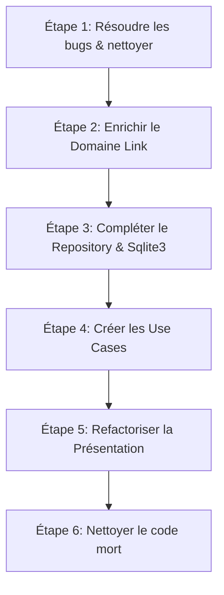

# Audit de la Refactorisation DDD - ShortURL

Ce document présente l'audit de l'état actuel de la refactorisation DDD (Domain-Driven Design) du projet ShortURL, basé sur les modifications de la branche `wip-refactor-ddd` par rapport à `main`.

---

## 📊 État Actuel & Points Positifs

La refactorisation a déjà permis d'assainir considérablement la structure globale de l'application en séparant le code en trois couches principales :
- **Domain (`src/Domain`)** : Définition de l'entité/agrégat `Link`, de l'interface du dépôt `LinkRepositoryInterface` et du générateur de clé `KeyGenerator`.
- **Infrastructure (`src/Infrastructure`)** : Implémentations techniques concrètes (gestion SQLite, Cache, Firewall de sécurité, Serveur HTTP).
- **Presentation (`src/Presentation`)** : Définition des routes et des contrôleurs HTTP.

L'introduction de `node-router` et la centralisation de la gestion du serveur dans une classe propre `Server` améliorent la lisibilité et l'extensibilité du projet.

---

## 🔍 Points d'Attention & Non-Conformités DDD

Bien que l'architecture globale progresse dans le bon sens, plusieurs écarts importants par rapport aux principes DDD et des bugs techniques subsistent.

### 1. Fuite d'Infrastructure dans la Présentation (Violation DDD)
Dans le fichier [ShortyRoute.js](file:///home/guillaume/projects/perso/shorturl/src/Presentation/routes/api/ShortyRoute.js), la persistance des liens raccourcis utilise des appels directs à la base de données SQLite :
```javascript
const stmt = db.prepare('INSERT INTO urls (short_code, original_url) VALUES (?, ?)');
stmt.run(shortCode, originalUrl, function (err) { ... });
```
La couche de présentation ne doit **jamais** manipuler directement la base de données ou connaître des détails d'infrastructure. Elle doit interagir uniquement avec les abstractions (Repository, Use Cases / Application Services).

### 2. Dépôt (Repository) Incomplet
La classe [LinkRepositoryInterface](file:///home/guillaume/projects/perso/shorturl/src/Domain/links/LinkRepositoryInterface.js) et son implémentation [LinkRepository](file:///home/guillaume/projects/perso/shorturl/src/Infrastructure/Repository/LinkRepository.js) ne définissent que la méthode de récupération `retrieveLinkByShortCode`. Il manque la méthode de création/sauvegarde (ex: `save(link)`), ce qui a conduit au contournement mentionné ci-dessus.

### 3. Absence de la Couche Application (Use Cases / Services)
Actuellement, les routes de présentation gèrent directement l'orchestration des tâches (validation des entrées HTTP, génération de la clé, persistance et formatage de la réponse). 
Dans un DDD propre, la logique métier/orchestration doit être encapsulée dans des **Cas d'Utilisation (Use Cases)** ou des **Services d'Application** (ex: `CreateShortLinkUseCase`, `GetLinkUseCase`). Les routes ne devraient faire que recevoir la requête, appeler le Use Case approprié et retourner la réponse.

### 4. Modèle de Domaine Anémique
L'entité [Link](file:///home/guillaume/projects/perso/shorturl/src/Domain/links/Link.js) est actuellement une simple classe de données (DTO) avec des getters et setters publics non protégés :
```javascript
set shortCode(shortCode) { this.#shortCode = shortCode; }
set originalUrl(originalUrl) { this.#originalUrl = originalUrl; }
```
Dans le DDD, le modèle de domaine doit être "riche" et défendre ses invariants. Par exemple, valider le format de l'URL ou empêcher la modification de ses propriétés une fois instancié si les règles métier l'interdisent.

### 5. Positionnement du DTO de Redirection
Le fichier [RedirectDto.js](file:///home/guillaume/projects/perso/shorturl/src/Infrastructure/Dto/RedirectDto.js) est placé dans la couche `Infrastructure`. Or, la redirection HTTP (statut 308, en-têtes de cache HTTP) est une préoccupation purement liée à la couche de **Présentation** (ou d'Application). L'infrastructure ne devrait pas manipuler des concepts liés aux réponses HTTP.

### 6. Couplage et Injection de Dépendances
Les routes instancient manuellement leurs dépendances (ex: `new LinkRepository(db, urlCache)` dans `CodeRoute.js`). De plus, le serveur passe des instances brutes de `db` et `urlCache` aux gestionnaires de route. 
Idéalement, nous devrions injecter les services ou cas d'utilisation requis directement dans les constructeurs ou handlers des routes sans qu'elles aient besoin de connaître les détails d'implémentation de la DB ou du cache.

---

## 🐛 Bugs Techniques Détectés

### Erreur de Référence dans `ShortyRoute.js`
À la ligne 76 de [ShortyRoute.js](file:///home/guillaume/projects/perso/shorturl/src/Presentation/routes/api/ShortyRoute.js) :
```javascript
const hostHeader = req.headers.host || `${HOST}:${PORT}`;
```
Les variables `HOST` et `PORT` ne sont ni déclarées ni importées dans ce fichier. Si `req.headers.host` n'est pas fourni (cas rare mais possible), une erreur `ReferenceError` sera levée à l'exécution.

---

## 🚀 Prochaines Étapes Proposées (Plan d'Action)

Pour finaliser proprement la refactorisation DDD, voici la feuille de route recommandée :



### Étape 1 : Corrections immédiates
- Importer `HOST` et `PORT` (ou les lire depuis `process.env`) dans [ShortyRoute.js](file:///home/guillaume/projects/perso/shorturl/src/Presentation/routes/api/ShortyRoute.js).
- Déplacer [RedirectDto.js](file:///home/guillaume/projects/perso/shorturl/src/Infrastructure/Dto/RedirectDto.js) de `Infrastructure` vers `Presentation/routes/dto/` (ou un dossier Dto sous Presentation).

### Étape 2 : Enrichir l'entité `Link` (Domain)
- Ajouter un constructeur robuste ou une factory de validation pour s'assurer qu'un `Link` ne peut pas être créé avec des données invalides.
- Supprimer les setters ou les rendre privés si l'entité est censée être immuable après sa création.

### Étape 3 : Compléter la persistance (Repository & SQL Helper)
- Ajouter la méthode `async save(link)` dans [LinkRepositoryInterface](file:///home/guillaume/projects/perso/shorturl/src/Domain/links/LinkRepositoryInterface.js).
- Implémenter cette méthode dans [LinkRepository](file:///home/guillaume/projects/perso/shorturl/src/Infrastructure/Repository/LinkRepository.js) (en utilisant SQLite et le cache).
- Refactoriser [Sqlite3.js](file:///home/guillaume/projects/perso/shorturl/src/Infrastructure/Sqlite3.js) pour que toutes ses méthodes (dont `get`) retournent nativement des promesses, évitant ainsi le `new Promise` manuel et les callbacks dans le Repository.

### Étape 4 : Introduire les Use Cases (Application Layer)
Créer un répertoire `src/Application/` contenant les cas d'utilisation métier :
- `CreateShortLinkUseCase.js` :
  - Reçoit l'URL d'origine.
  - Génère le shortCode via le `KeyGenerator`.
  - Instancie l'agrégat `Link`.
  - Le persiste via le `LinkRepository`.
  - Retourne l'agrégat ou un résultat standardisé.
- `GetOriginalLinkUseCase.js` :
  - Récupère le lien original via `LinkRepository`.

### Étape 5 : Refactoriser la Présentation (Presentation Layer)
- Supprimer toute manipulation de `db` ou `urlCache` dans les routes.
- Injecter les instances de Repository et Use Cases dans les routes.
- Les routes ne doivent appeler que les Use Cases correspondants.

### Étape 6 : Nettoyer le code mort
- Nettoyer le code commenté obsolète dans [server.js](file:///home/guillaume/projects/perso/shorturl/src/server.js) et [Sqlite3.js](file:///home/guillaume/projects/perso/shorturl/src/Infrastructure/Sqlite3.js).
