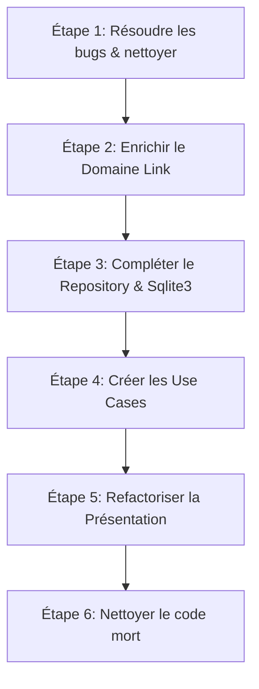
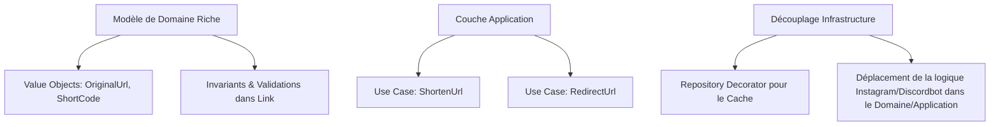

# Audit de la Refactorisation DDD - ShortURL

Ce document présente l'audit de l'état actuel de la refactorisation DDD (Domain-Driven Design) du projet ShortURL, basé sur les modifications de la branche `wip-refactor-ddd` par rapport à `main`.

---

## 📊 État Actuel & Points Positifs

La refactorisation a déjà permis d'assainir considérablement la structure globale de l'application en séparant le code en trois couches principales :
- **Domain (`src/Domain`)** : Définition de l'entité/agrégat `Link`, de l'interface du dépôt `LinkRepositoryInterface` et du générateur de clé `KeyGenerator`.
- **Infrastructure (`src/Infrastructure`)** : Implémentations techniques concrètes (gestion SQLite, Cache, Firewall de sécurité, Serveur HTTP).
- **Presentation (`src/Presentation`)** : Définition des routes et des contrôleurs HTTP.

L'introduction de `node-router` et la centralisation de la gestion du serveur dans une classe propre `Server` améliorent la lisibilité et l'extensibilité du projet.

---

## 🔍 Points d'Attention & Non-Conformités DDD

Bien que l'architecture globale progresse dans le bon sens, plusieurs écarts importants par rapport aux principes DDD et des bugs techniques subsistent.

### 1. Fuite d'Infrastructure dans la Présentation (Violation DDD)
Dans le fichier [ShortyRoute.js](file:///home/guillaume/projects/perso/shorturl/src/Presentation/routes/api/ShortyRoute.js), la persistance des liens raccourcis utilise des appels directs à la base de données SQLite :
```javascript
const stmt = db.prepare('INSERT INTO urls (short_code, original_url) VALUES (?, ?)');
stmt.run(shortCode, originalUrl, function (err) { ... });
```
La couche de présentation ne doit **jamais** manipuler directement la base de données ou connaître des détails d'infrastructure. Elle doit interagir uniquement avec les abstractions (Repository, Use Cases / Application Services).

### 2. Dépôt (Repository) Incomplet
La classe [LinkRepositoryInterface](file:///home/guillaume/projects/perso/shorturl/src/Domain/links/LinkRepositoryInterface.js) et son implémentation [LinkRepository](file:///home/guillaume/projects/perso/shorturl/src/Infrastructure/Repository/LinkRepository.js) ne définissent que la méthode de récupération `retrieveLinkByShortCode`. Il manque la méthode de création/sauvegarde (ex: `save(link)`), ce qui a conduit au contournement mentionné ci-dessus.

### 3. Absence de la Couche Application (Use Cases / Services)
Actuellement, les routes de présentation gèrent directement l'orchestration des tâches (validation des entrées HTTP, génération de la clé, persistance et formatage de la réponse). 
Dans un DDD propre, la logique métier/orchestration doit être encapsulée dans des **Cas d'Utilisation (Use Cases)** ou des **Services d'Application** (ex: `CreateShortLinkUseCase`, `GetLinkUseCase`). Les routes ne devraient faire que recevoir la requête, appeler le Use Case approprié et retourner la réponse.

### 4. Modèle de Domaine Anémique
L'entité [Link](file:///home/guillaume/projects/perso/shorturl/src/Domain/links/Link.js) est actuellement une simple classe de données (DTO) avec des getters et setters publics non protégés :
```javascript
set shortCode(shortCode) { this.#shortCode = shortCode; }
set originalUrl(originalUrl) { this.#originalUrl = originalUrl; }
```
Dans le DDD, le modèle de domaine doit être "riche" et défendre ses invariants. Par exemple, valider le format de l'URL ou empêcher la modification de ses propriétés une fois instancié si les règles métier l'interdisent.

### 5. Positionnement du DTO de Redirection
Le fichier [RedirectDto.js](file:///home/guillaume/projects/perso/shorturl/src/Infrastructure/Dto/RedirectDto.js) est placé dans la couche `Infrastructure`. Or, la redirection HTTP (statut 308, en-têtes de cache HTTP) est une préoccupation purement liée à la couche de **Présentation** (ou d'Application). L'infrastructure ne devrait pas manipuler des concepts liés aux réponses HTTP.

### 6. Couplage et Injection de Dépendances
Les routes instancient manuellement leurs dépendances (ex: `new LinkRepository(db, urlCache)` dans `CodeRoute.js`). De plus, le serveur passe des instances brutes de `db` et `urlCache` aux gestionnaires de route. 
Idéalement, nous devrions injecter les services ou cas d'utilisation requis directement dans les constructeurs ou handlers des routes sans qu'elles aient besoin de connaître les détails d'implémentation de la DB ou du cache.

---

## 🐛 Bugs Techniques Détectés

### Erreur de Référence dans `ShortyRoute.js`
À la ligne 76 de [ShortyRoute.js](file:///home/guillaume/projects/perso/shorturl/src/Presentation/routes/api/ShortyRoute.js) :
```javascript
const hostHeader = req.headers.host || `${HOST}:${PORT}`;
```
Les variables `HOST` et `PORT` ne sont ni déclarées ni importées dans ce fichier. Si `req.headers.host` n'est pas fourni (cas rare mais possible), une erreur `ReferenceError` sera levée à l'exécution.

---

## 🚀 Prochaines Étapes Proposées (Plan d'Action)

Pour finaliser proprement la refactorisation DDD, voici la feuille de route recommandée :



### Étape 1 : Corrections immédiates
- Importer `HOST` et `PORT` (ou les lire depuis `process.env`) dans [ShortyRoute.js](file:///home/guillaume/projects/perso/shorturl/src/Presentation/routes/api/ShortyRoute.js).
- Déplacer [RedirectDto.js](file:///home/guillaume/projects/perso/shorturl/src/Infrastructure/Dto/RedirectDto.js) de `Infrastructure` vers `Presentation/routes/dto/` (ou un dossier Dto sous Presentation).

### Étape 2 : Enrichir l'entité `Link` (Domain)
- Ajouter un constructeur robuste ou une factory de validation pour s'assurer qu'un `Link` ne peut pas être créé avec des données invalides.
- Supprimer les setters ou les rendre privés si l'entité est censée être immuable après sa création.

### Étape 3 : Compléter la persistance (Repository & SQL Helper)
- Ajouter la méthode `async save(link)` dans [LinkRepositoryInterface](file:///home/guillaume/projects/perso/shorturl/src/Domain/links/LinkRepositoryInterface.js).
- Implémenter cette méthode dans [LinkRepository](file:///home/guillaume/projects/perso/shorturl/src/Infrastructure/Repository/LinkRepository.js) (en utilisant SQLite et le cache).
- Refactoriser [Sqlite3.js](file:///home/guillaume/projects/perso/shorturl/src/Infrastructure/Sqlite3.js) pour que toutes ses méthodes (dont `get`) retournent nativement des promesses, évitant ainsi le `new Promise` manuel et les callbacks dans le Repository.

### Étape 4 : Introduire les Use Cases (Application Layer)
Créer un répertoire `src/Application/` contenant les cas d'utilisation métier :
- `CreateShortLinkUseCase.js` :
  - Reçoit l'URL d'origine.
  - Génère le shortCode via le `KeyGenerator`.
  - Instancie l'agrégat `Link`.
  - Le persiste via le `LinkRepository`.
  - Retourne l'agrégat ou un résultat standardisé.
- `GetOriginalLinkUseCase.js` :
  - Récupère le lien original via `LinkRepository`.

### Étape 5 : Refactoriser la Présentation (Presentation Layer)
- Supprimer toute manipulation de `db` ou `urlCache` dans les routes.
- Injecter les instances de Repository et Use Cases dans les routes.
- Les routes ne doivent appeler que les Use Cases correspondants.

### Étape 6 : Nettoyer le code mort
- Nettoyer le code commenté obsolète dans [server.js](file:///home/guillaume/projects/perso/shorturl/src/server.js) et [Sqlite3.js](file:///home/guillaume/projects/perso/shorturl/src/Infrastructure/Sqlite3.js).
________________________________________________________________________________________________________________________________________________________________________________________________________________________________

# Audit DDD (Domain-Driven Design) - Projet Shorty

Cet audit présente une analyse critique de l'implémentation actuelle du projet **Shorty** au regard des principes et patterns tactiques du **Domain-Driven Design (DDD)** et de la **Clean Architecture**.

---

## 1. Synthèse Générale & Analyse Globale

Le projet est structuré selon une architecture en couches (`Domain`, `Application`, `Infrastructure`, `Presentation`), ce qui démontre une intention claire de séparer les responsabilités. Cependant, dans son état actuel :
* **Le modèle de domaine est anémique** : la logique métier (validation de format, règles de redirection spécifiques) est éparpillée en dehors de la couche `Domain`.
* **La couche Application est vide** : il n'y a aucun cas d'utilisation (Use Cases). La couche `Presentation` (les routes) orchestre directement le domaine et l'infrastructure.
* **Fuites de logique métier dans la Présentation** : des règles de redirection (ex: détection de Discordbot pour Instagram) et de validation de format d'URL sont codées en dur dans les routeurs.

---

## 2. Analyse Détaillée par Couche

### A. La Couche Domain (`src/Domain/links`)

#### 1. L'Entité / Agrégat `Link` ([Link.js](file:///Users/guillaume/shorty/src/Domain/links/Link.js))
* **Modèle Anémique** : L'entité `Link` ne contient aucun comportement ni validation d'invariants (par exemple, s'assurer que l'URL d'origine est valide et non vide). Elle sert de simple conteneur de données (structure de type "Anemic Domain Model").
* **Mutabilité non contrôlée** : La présence de setters publics (`set shortCode`, `set originalUrl`) permet de modifier l'état d'un lien après sa création de manière arbitraire depuis n'importe quelle couche, ce qui viole l'encapsulation de l'agrégat.

#### 2. Absence de Value Objects
* Les concepts de **Code Court (Short Code)** et d'**URL d'Origine (Original URL)** sont représentés par des chaînes de caractères primitives (`string`).
* En DDD, ces concepts devraient être modélisés comme des **Value Objects** (ex: `ShortCode`, `OriginalUrl`) encapsulant leurs propres règles de validation (format, longueur, protocoles supportés).

#### 3. Le Service de Domaine `KeyGenerator` ([KeyGenerator.js](file:///Users/guillaume/shorty/src/Domain/links/KeyGenerator.js))
* La génération de clé est correctement identifiée comme un Domain Service ou un outil utilitaire du domaine.
* Cependant, l'implémentation actuelle utilise `process.hrtime.bigint()`, créant un couplage fort avec le runtime Node.js directement dans le Domaine. Il serait préférable de définir une interface abstraite dans le Domaine et de laisser l'infrastructure fournir l'implémentation concrète, ou de s'assurer que le domaine ne dépend pas d'éléments environnementaux globaux si on souhaite le garder pur.

#### 4. Interface du Repository `LinkRepositoryInterface` ([LinkRepositoryInterface.js](file:///Users/guillaume/shorty/src/Domain/links/LinkRepositoryInterface.js))
* **Excellente pratique** : L'interface du dépôt est définie au sein du Domaine sous forme d'une classe abstraite, garantissant l'indépendance du domaine vis-vis des détails d'implémentation de la persistance (principe de Dependency Inversion).

---

### B. La Couche Application (`src/Application`)
* **Absence totale de Use Cases** : Le répertoire est actuellement vide.
* En DDD, c'est la couche Application qui orchestre les flux de contrôle et exécute les cas d'utilisation (ex: *Créer un lien raccourci*, *Récupérer l'URL originale*).
* Actuellement, cette orchestration est réalisée directement par les contrôleurs/routes de la couche Présentation, ce qui nuit à la testabilité et à la réutilisabilité de la logique applicative.

---

### C. La Couche Infrastructure (`src/Infrastructure`)

#### 1. Le Dépôt Implémenté `LinkRepository` ([LinkRepository.js](file:///Users/guillaume/shorty/src/Infrastructure/Repository/LinkRepository.js))
* Le dépôt implémente correctement `LinkRepositoryInterface` pour SQLite.
* **Mélange des responsabilités** : Le dépôt gère simultanément la persistance SQL (`Sqlite3`) et la stratégie de cache en mémoire (`urlCache`). En DDD, la mise en cache est une préoccupation transversale d'infrastructure qui devrait être découplée (par exemple en utilisant un pattern *Decorator* de Repository) pour que le dépôt SQL ne se préoccupe que de la base de données.

#### 2. Positionnement des DTOs ([RedirectDto.js](file:///Users/guillaume/shorty/src/Infrastructure/Dto/RedirectDto.js))
* Le `RedirectDto` est situé dans `Infrastructure/Dto`. Les DTOs (Data Transfer Objects) servent de contrats d'interface pour échanger des données entre la couche Présentation/Application et l'extérieur. Ils appartiennent plus naturellement à la couche Application ou Présentation qu'à la couche pure d'Infrastructure.

---

### D. La Couche Presentation (`src/Presentation`)

#### 1. Le Routeur d'API `ShortyRoute` ([ShortyRoute.js](file:///Users/guillaume/shorty/src/Presentation/routes/api/ShortyRoute.js))
* **Surplus de responsabilités (Fat Controller)** :
  * Validation syntaxique et technique des URLs (longueur, format via `new URL()`, protocoles `http/https`) dans le handler HTTP.
  * Orchestration directe : appel à `linkFactory.create()` puis `linkRepository.save()`.
  * Construction de la réponse HTTP et formatage des URLs raccourcies.
* **Correction DDD** : La validation syntaxique d'une URL est une règle métier et devrait être déléguée au modèle de domaine (Value Object `OriginalUrl`). L'orchestration devrait être confiée à un cas d'utilisation (Use Case) applicatif.

#### 2. Le Routeur de Redirection `CodeRoute` ([CodeRoute.js](file:///Users/guillaume/shorty/src/Presentation/routes/CodeRoute.js))
* **Fuite de logique métier** : La détection spécifique de `Discordbot` pour les liens Instagram (`instagram.com`) afin de renvoyer un HTML spécifique est une **règle métier** (une politique de redirection conditionnelle). Elle est actuellement codée directement dans le contrôleur HTTP. Cette logique devrait être encapsulée dans le Domaine ou au moins orchestrée par un cas d'utilisation applicatif.

---

## 3. Plan d'Action & Recommandations

Pour aligner le projet Shorty avec les meilleures pratiques DDD et Clean Architecture, voici les chantiers recommandés :



### Étape 1 : Rendre le Modèle de Domaine Riche (Rich Domain Model)
1. **Créer des Value Objects** :
   * `OriginalUrl` : gère la validation du format URL, de la longueur (max 2048) et des protocoles admis (`http`, `https`).
   * `ShortCode` : gère la validation du code court généré ou personnalisé (longueur, caractères alphanumériques).
2. **Refactorer l'Entité `Link`** :
   * Supprimer les setters publics pour garantir l'immutabilité et l'intégrité de l'entité.
   * Lever des exceptions de domaine si les invariants ne sont pas respectés lors de la construction.

### Étape 2 : Introduire la Couche Application (Use Cases)
1. Créer la classe `ShortenUrlUseCase` :
   * Prend en entrée une URL d'origine brute.
   * Utilise `LinkFactory` pour générer le lien.
   * Sauvegarde le lien via le `LinkRepository`.
   * Retourne le lien créé (ou un DTO de sortie).
2. Créer la classe `RedirectUrlUseCase` (ou `GetOriginalUrlUseCase`) :
   * Prend en entrée un code court.
   * Récupère le lien dans le `LinkRepository`.
   * Analyse s'il y a des politiques spécifiques de redirection (comme le cas Instagram + Discordbot) en collaborant avec une politique de domaine (`RedirectionPolicy`).

### Étape 3 : Découpler l'Infrastructure et la Présentation
1. **Pattern Decorator pour le Cache** :
   * Créer un `CachingLinkRepository` qui implémente `LinkRepositoryInterface`.
   * Ce décorateur encapsule le `LinkRepository` SQL d'origine et gère la logique de lecture/écriture dans le cache `urlCache`.
2. **Nettoyer les Routes** :
   * Les routes doivent uniquement s'occuper de lire la requête HTTP (extraire les paramètres, le corps), appeler le Use Case applicatif correspondant, et transformer le résultat (ou l'exception) en réponse HTTP (JSON, HTML ou redirection).
